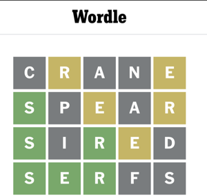
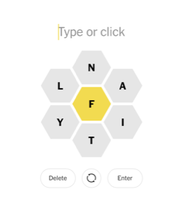
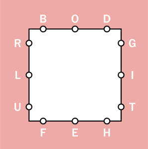

## NYT Game Genie
### *A tool for cheating at (some of) the NYT games*
### Why?
Good question. It struck me as rather obvious that a computer would be good at these games, so I made that come true 🤷‍♂️


#### Usage
```
Usage: nyt_game_genie.rb [options]
    -d, --dictionary=<path to file>  path to newline-delimited dictionary
    -l, --letters=<letters>          for letter boxed and spelling bee: valid game letters (including middle letter)
    -x, --max-depth=<depth>          for letter boxed: maximum number of words in solution (defaults to 4)
    -s, --letters_per_side           for letter boxed: the number of letters per side (defaults to 3)
        --middle=<middle>            for spelling bee: the middle letter
    -j, --javascript                 for spelling_bee: output javascript to automatically solve the puzzle
    -p, --patterns=<patterns>        for wordle: comma separated regex, defaults to '.' for each letter
    -w, --without=<without>          for wordle: exclude all words containing provided letters
    -m, --must-have=<must_have>      for wordle: word must have provided letters
    -c, --copy                       (on macOS) copy output to clipboard
    -g, --game=GAME                  game name [(l)etter_boxed|(w)ordle|(s)pelling_bee] (only the first letter matters)
```

### Examples:
*(n.b. no dictionary is included in this repository but this doesn't work without one. I used https://github.com/JadedTuna/apple-dictionary to pull the included apple dictionary into a sqlite db and then extracted all the words into a newline delimited text file.)*

#### Wordle

Say you have this wordle board:


```
> ./nyt_game_genie.rb -g wordle -d dictionaries/aoed.txt -p "s,e,r,.,." -m ser -w canpidf
Wordle:
serge
serow
serum
serve
servo
servo
```

#### Spelling Bee

Given this spelling bee board:


```
> ./nyt_game_genie.rb -g spelling_bee -d dictionaries/aoed.txt -l naitylf -e f -j -c
Spelling Bee:
(function() {
  var words = ['affiant','affinity', etc...];

  function typeAll(words) {

    etc...

  typeAll(words);
})();
```

Paste the generated javascript into a console (the '-c' option copies it to your clipboard when run in Terminal.app on a mac) for the spelling bee page and it'll do all the typing for you! Note that you have to manually close the congrats modal when you hit genius for the script to keep entering words. If you're fast enough closing it you can get to queen bee in one try, otherwise you have to run it again. Also note that whether this script gets to queen bee is entirely dependent on your dictionary, the dictionary I extracted from the apple default AOED does not always get all the words (it does always get at least genius, though).

#### Letter Boxed

Given this letter boxed board:


```
> ./nyt_game_genie.rb -g l -d dictionaries/aoed.txt -l bodgithefulr -x 3
Letter Boxed:
Found 483 words. Finding solutions of max depth 3
lift, thoroughbred
flirt, thoroughbred
filet, thoroughbred
filbert, thoroughbred
budget, thrift, tole
driblet, tuft, tough
budget, thot, trifle
budget, thrift, toil
driblet, tuft, trough
delft, thought, tribe
 etc...
```

```
./nyt_game_genie.rb -g l -d dictionaries/aoed.txt -l bodgithefulr -x 3  7.08s user 0.08s system 97% cpu 7.341 total
```

Kinda slow though (~7 seconds on my M1 Max), right? Well you're in luck! The same algorithm written in go is a *lot* faster:

```
  ./letter_box -dictionary dictionaries/aoed.txt -letters bodgithefulr -max 3  0.15s user 0.01s system 34% cpu 0.467 total
```

(0.15 seconds! :)
